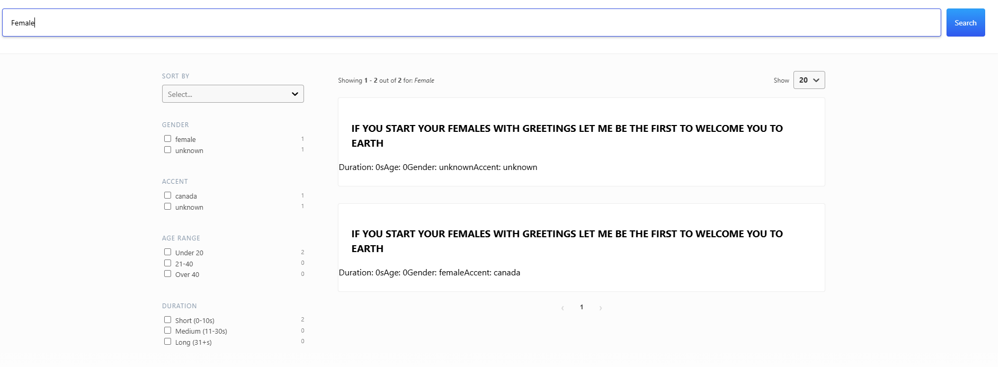

### technicaltest

I created a conda environment to run the project in. 

Conda environment creation : 

conda create --name takehometest python=3.9
conda activate takehometest

clone this repo and cd into the main directory
pip install -r requirements.txt

verify all the files are install by using : pip list

Once you are done using the environment :

conda deactivate
conda remove --name takehometest --all

## Task 1 :

For the first task related to asr_api.py to run the application : 

running application : uvicorn asr_api:app --host 0.0.0.0 --port 8001

Open another cmd and type this in :

curl -F "file=@C:\\Users\\akash\\Documents\\GitHub\\technicaltest\\ASR\\cv-valid-dev\\cv-valid-dev\\sample-000000.mp3" http://localhost:8001/asr

results : 

{"transcription":"SHE COMPOSED AN EMOTIONAL SONG IN HER BEDROOM","duration":"3.2"}

## Task 2 :

python cv-decode.py

After running this a new column will be formed in the new csv file called cv-valid-dev-updated.csv 

## Task 3 : 

After dockerizing the application, you can run it this way to do task 1.

docker build -t asr-api .
docker run -p 8001:8001 --name asr-api-container asr-api

## Task 4 : 

docker-compose build, to build the multi-container consisting of the elastic search container as well as the search ui container
docker-compose up -d once built
open your browser and type http://localhost:3000

You can also use the filter function as shown below :

You can also use the search function accordingly :

Search UI is the frontend service.

We use lmaozedonghehe/asr-search-ui:latest as the image for the react application. Port 80 is mapped from inside the container to 3000 on the host. The UI then can be accessed via http://localhost:3000.

We do health checks on the elasticsearch nodes before starting. We ensure the UI service is running by making a simple HTTP request (curl -f http://localhost).

es01 is the first node in an elasticsearch cluster. lmaozedonghehe/custom-elasticsearch:latest is a custom Elasticsearch Docker image used which was created by me. 

Acts as the second node in the Elasticsearch cluster.
Details: Identical to es01, except for the node name (node.name=es02). It uses the same configuration to join the cluster with es01.

Persistent storage for Elasticsearch data and logs, ensuring that data is not lost when containers restart.

A single network named elastic is defined using the default bridge driver. All services connect to this network, ensuring they can communicate.

## Trouble shooting steps used by me, not relevant to setup : 

docker logs es01
docker logs es02
curk http://localhost:9200
curl http://localhost:9200/cv-transcriptions/_search?pretty

deleting existing indexing
curl -X DELETE http://localhost:9200/cv-transcriptions

checking indexing
curl http://localhost:9200/cv-transcriptions/_search?pretty

curl "http://localhost:9200/cv-transcriptions/_search?pretty&size=20" - to show more than 10 which is the default

yarn install
yarn run build 
yarn start
/mnt/c/Users/akash/Documents/GitHub/technicaltest/ASR/search-ui/node_modules$ yarn add @elastic/search-ui @elastic/react-search-ui @elastic/react-search-ui-views -W